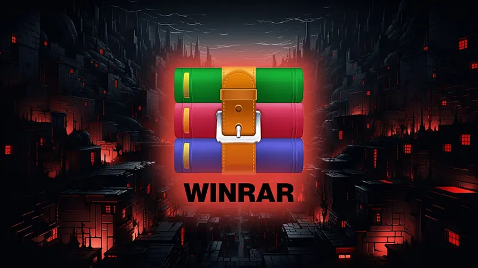

# 🚀 **winrar password cracker** | **rar crack**

Imagine transforming your workflows with cutting-edge technology designed for unmatched precision and dependability. **winrar password cracker** delivers top-tier **software quality** and unparalleled reliability, empowering you to focus on what truly matters. With advanced features tailored for efficiency, this solution redefines how you approach everyday challenges.

Ready to experience the future of **rar crack**?  

## 🛡️ Trust and Reliability with **winrar crack**

At **winrar crack**, we understand that trust is the foundation of any successful relationship. That's why we prioritize security, privacy, and reliability in everything we do. Here's how we ensure you can trust our platform:

### Software Security Measures 🔒
Our software incorporates advanced security protocols to safeguard your data:
- **End-to-end encryption** ensures all communication is secure.
- **Multi-factor authentication (MFA)** adds an extra layer of protection to your account.
- **Regular penetration testing** helps identify and resolve vulnerabilities before they become issues.

### Data Protection and Privacy 📊
Your privacy is paramount. We adhere to strict data protection standards:
- **Compliance with global regulations** such as GDPR and CCPA ensures your rights are respected.
- **Transparent data handling policies** mean you always know how your information is used.
- **Minimal data collection** focuses only on what’s necessary for functionality.

### Regular Security Updates ⏳
Staying ahead of potential threats is crucial. Our team provides:
- **Frequent updates** to patch vulnerabilities and enhance performance.
- **Automated alerts** notify users of important security changes.
- **Proactive monitoring** keeps us vigilant against emerging risks.

### Safe Download Process with **rar password crack** 📥
When downloading **winrar crack**, rest assured it’s a safe process thanks to **rar password crack**:
- **Verified download links** guarantee authenticity.
- **Digital signatures** confirm the integrity of each release.
- **Detailed installation guides** make setup simple and secure.

### Proven Track Record 🏆
We’ve earned the trust of thousands of users worldwide through:
- **Years of experience** delivering reliable solutions.
- **Positive feedback** from satisfied customers.
- **Industry recognition** for excellence in security and innovation.

---

Ready to experience the unmatched security and reliability of **winrar crack**? Get started today!

## Benefits of Using **winrar password remover**

Discover why **winrar password remover** is the ultimate choice for your software needs:

- 🚀 **Professional Software Capabilities**: With **winrar password remover**, you gain access to advanced tools designed for top-notch performance. These capabilities ensure that both beginners and experts can achieve their goals with ease, making it an indispensable asset for any project.

- 🖥️ **User-Friendly Interface**: The intuitive design of **winrar password remover** ensures a seamless experience for all users. Its straightforward layout minimizes the learning curve, allowing you to focus on what truly matters—leveraging **rar password crack** features effectively.

- 🔧 **Regular Updates and Improvements**: Stay ahead of the curve with consistent updates that introduce new functionalities and optimizations. This commitment to progress ensures that **winrar password remover** remains at the forefront of technology, delivering maximum value over time.

- 📞 **Technical Support Availability**: Need assistance? Our dedicated support team is always ready to help. Whether you have questions about **rar password crack** integration or troubleshooting tips, we’re here to provide timely solutions.

Ready to elevate your workflow? Explore more about **winrar password remover** today!

## Getting Started with **winrar password cracker**

Welcome to **winrar password cracker**! Below is a step-by-step guide to help you get started quickly and efficiently. Follow these actionable steps to download, install, configure, and begin using **winrar password cracker** for your projects.

### Steps to Start Using **winrar password cracker**

1. 📥 **Download and Installation**
   - Visit the official **winrar password cracker** website or repository.
   - Download the latest stable release of **winrar password cracker**.
   - Run the installer or extract the files if it’s a compressed package.
   - Ensure that all dependencies, including **winrar password cracker online**, are installed on your system.

2. 🔧 **Initial Setup**
   - Once installed, locate the main executable file or launch **winrar password cracker** from your application menu.
   - Follow the setup wizard to complete the initial configuration process.
   - If no wizard is available, refer to the `setup_guide.md` included in the installation folder.

3. 🛠️ **Basic Configuration**
   - Open the configuration file (`config.json` or similar) located in the installation directory.
   - Customize settings such as **winrar password cracker online** integration, language preferences, and default options.
   - Save the changes and restart **winrar password cracker** to apply them.

4. 🚀 **First Use Guide**
   - Launch **winrar password cracker** and explore the dashboard or interface.
   - Perform a test run by creating or loading a sample project to ensure everything is working correctly.
   - Refer to the documentation for advanced features and troubleshooting tips.

---

### Ready to Get Started?

Don’t wait—start harnessing the power of **winrar password cracker** today! For further assistance, check out our comprehensive documentation or join our community forums.

